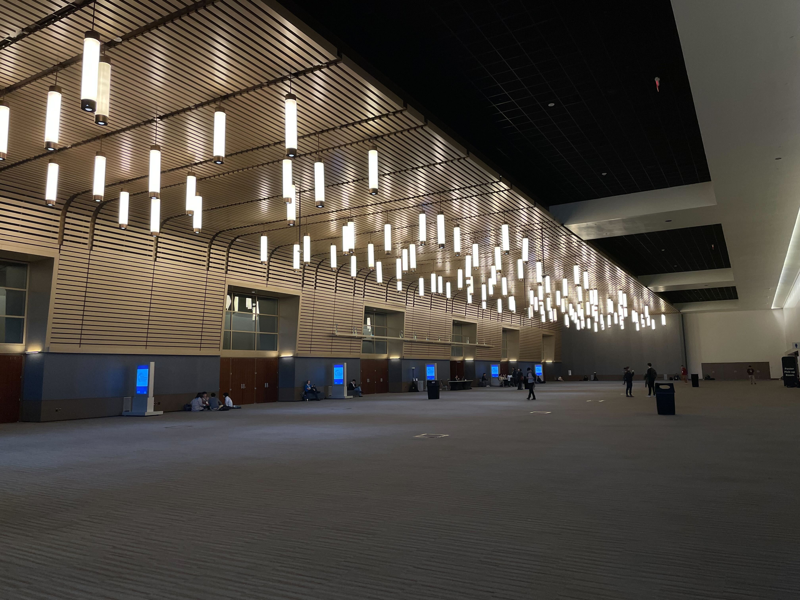
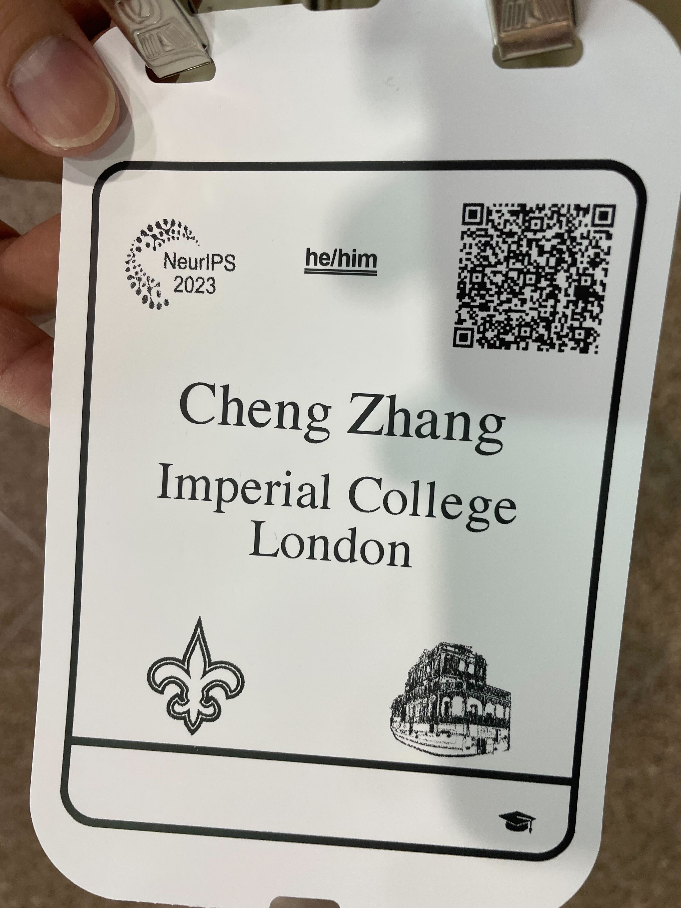
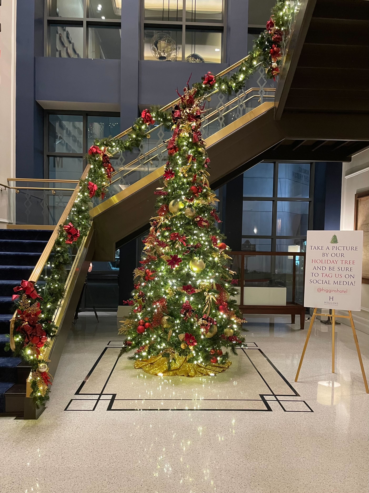
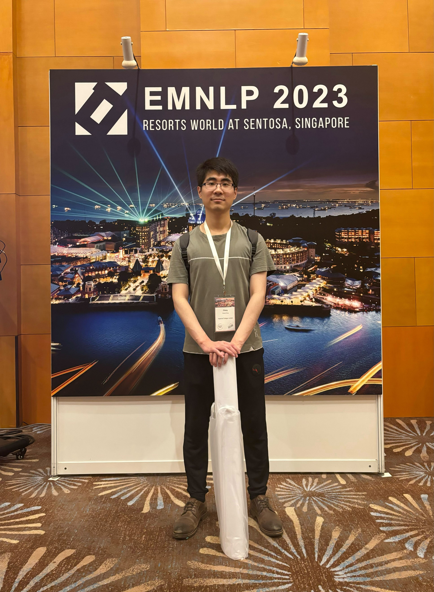
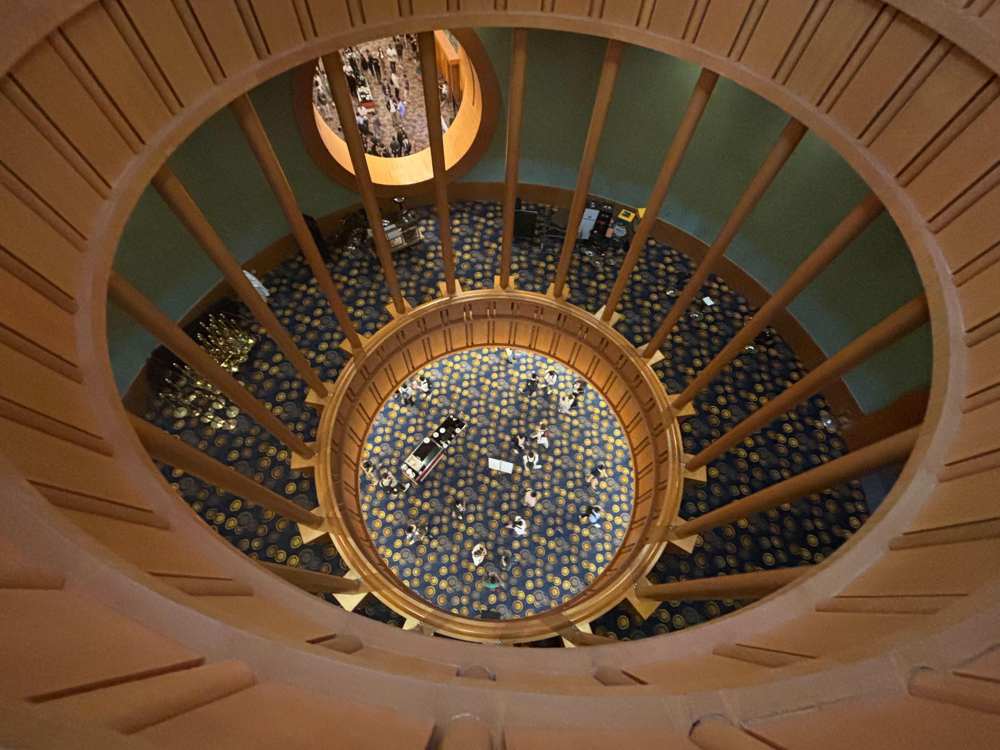
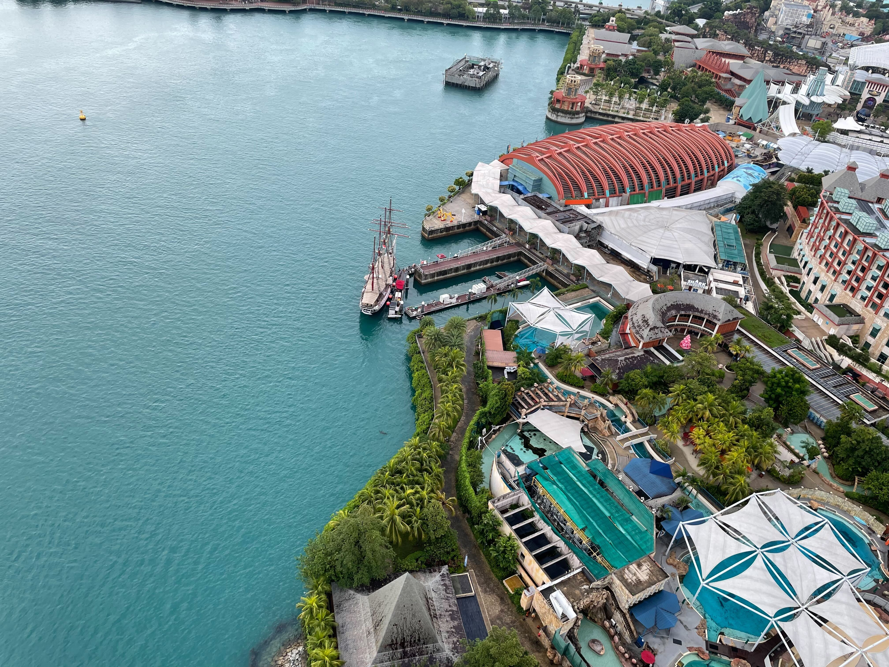

---
hide:
   - navigation
   - toc
---

# Updates

- 10/12/2023 - 16/12/2023: Presented our work at [NeurIPS2023](https://neurips.cc/Conferences/2023/Dates), New Orleans Ernest N. Morial Convention Center.

    ??? tip "NeurIPS2023 @ New Orleans Ernest N. Morial Convention Center"
        | Convention Center | Badge | Xmas tree at Hotel |
        |:-------------------------:|:-------------------------:|:-------------------------:|
        |<figure markdown>{ width="400" }<figcaption></figcaption></figure>| <figure markdown>{ width="250" }<figcaption></figcaption></figure> | <figure markdown>{ width="250" }<figcaption></figcaption></figure> |

- 05/12/2023 - 09/12/2023: Presented our work at [EMNLP2023](https://2023.emnlp.org/program/accepted_main_conference/), Sentosa, Singapore.

    ??? tip "EMNLP2023 @ Resorts World Convention Centre"
        | Convention Centre | Convention Centre | Resorts World |
        |:-------------------------:|:-------------------------:|:-------------------------:|
        |<figure markdown>{ width="300" }<figcaption></figcaption></figure>| <figure markdown>{ width="400" }<figcaption></figcaption></figure> |<figure markdown>{ width="400" }<figcaption></figcaption></figure>|

- 31/10/2023: 🥳 Workshop paper accepted to [NeurIPS2023 workshop on ML for Systems](<http://mlforsystems.org/>)

- 23/10/2023: 🥳 [Paper](https://arxiv.org/pdf/2310.05079.pdf) accepted to [EMNLP2023](https://2023.emnlp.org/)

- 07/01/2023: I am happy to start my PhD study and to be a member of [SpatialML](https://spatialml.net/)
