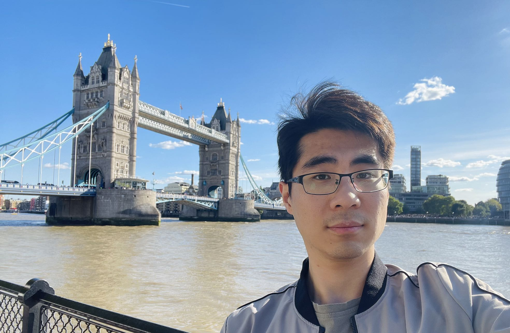

---
hide:
   - footer
   - navigation
   - toc
---

# About me

<figure>
    
</figure>

Cheng Zhang   [:fontawesome-solid-envelope:](mailto: chengzhang98@outlook.com)     [:fontawesome-brands-linkedin:](https://www.linkedin.com/in/chengzhang98)     [:fontawesome-brands-github:](https://github.com/ChengZhang-98)

I am Cheng Zhang, a first-year PhD student in [Circuits and System Group](https://www.imperial.ac.uk/electrical-engineering/research/circuits-and-systems/), the Department of Electrical and Electronic Engineering, Imperial College London, supervised by [Dr Yiren (Aaron) Zhao](https://aaronzhao.me/) and [Prof George A. Constantinides](https://cas.ee.ic.ac.uk/people/gac1/). My research interests mainly include efficient machine learning and AI acceleration.

## Education

- PhD in Electrical and Electronic Engineering, Imperial College London, Jan 2023 - Current
- MSc in Electronics, The University of Edinburgh, Sep 2021 - Aug 2022
- BEng in Automation, Beihang University, Sep 2017 - Jun 2021

## Publications

- [<u>\[ICML2024 Workshop\]</u>](https://arxiv.org/abs/2406.14963). Yuang Chen, **Cheng Zhang**, Xitong Gao, Robert D. Mullins, George A. Constantinides, Yiren Zhao. Optimised Grouped-Query Attention Mechanism for Transformers.

- [<u>\[ICML2024 Workshop\]</u>](https://arxiv.org/abs/2406.14956) Zixi Zhang, **Cheng Zhang**, Xitong Gao, Robert D. Mullins, George A. Constantinides, Yiren Zhao. Unlocking the Global Synergies in Low-Rank Adapters.

- [<u>\[ICML2024\]</u>](https://arxiv.org/abs/2402.02446) **Cheng Zhang**, Jianyi Cheng, George A. Constantinides, Yiren Zhao. LQER: Low-Rank Quantization Error Reconstruction for LLMs. *The Forty-first International Conference on Machine Learning*.

- [<u>[FPL2024]</u>](https://arxiv.org/abs/2406.03088). Zhewen Yu, Sudarshan Sreeram, Krish Agrawal, Junyi Wu, Alexander Montgomerie-Corcoran, **Cheng Zhang**, Jianyi Cheng, Christos-Savvas Bouganis, Yiren Zhao. HASS: Hardware-Aware Sparsity Search for Dataflow DNN Accelerator

- [<u>\[NeurIPS2023 Workshop\]</u>](http://mlforsystems.org/) **Cheng Zhang**, Jianyi Cheng, Zhewen Yu, Yiren Zhao. MASE: An Efficient Representation for Software-Defined ML Hardware System Exploration. *Workshop on ML for Systems at NeurIPS 2023*.

- [<u>\[EMNLP2023\]</u>](https://aclanthology.org/2023.emnlp-main.617.pdf) **Cheng Zhang**, Jianyi Cheng, Ilia Shumailov, George Anthony Constantinides, Yiren Zhao. Revisiting Block-based Quantisation: What is Important for Sub-8-bit LLM Inference? *Proceedings of the 2023 Conference on Empirical Methods in Natural Language Processing*.
